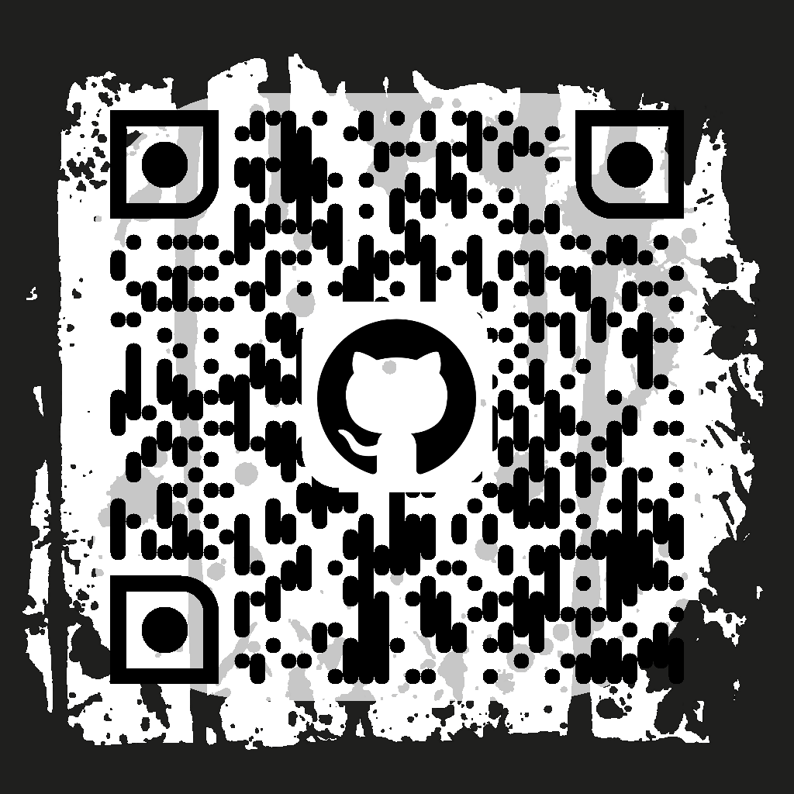
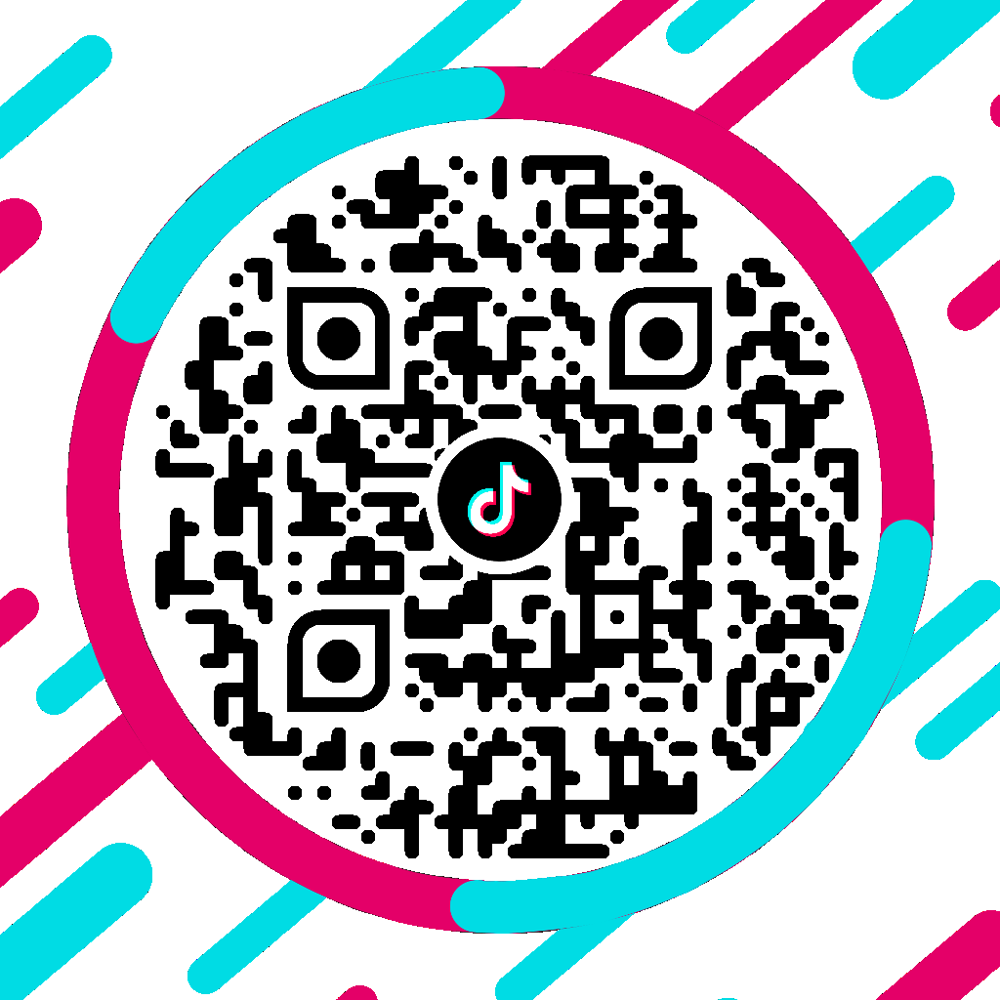
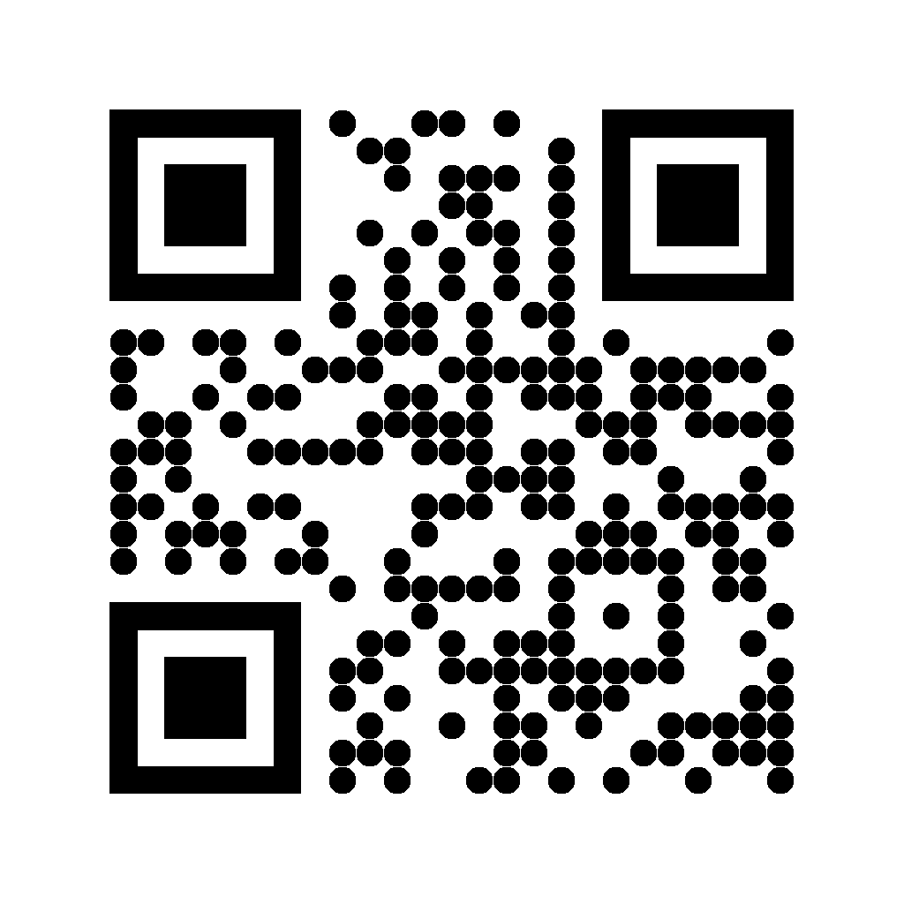
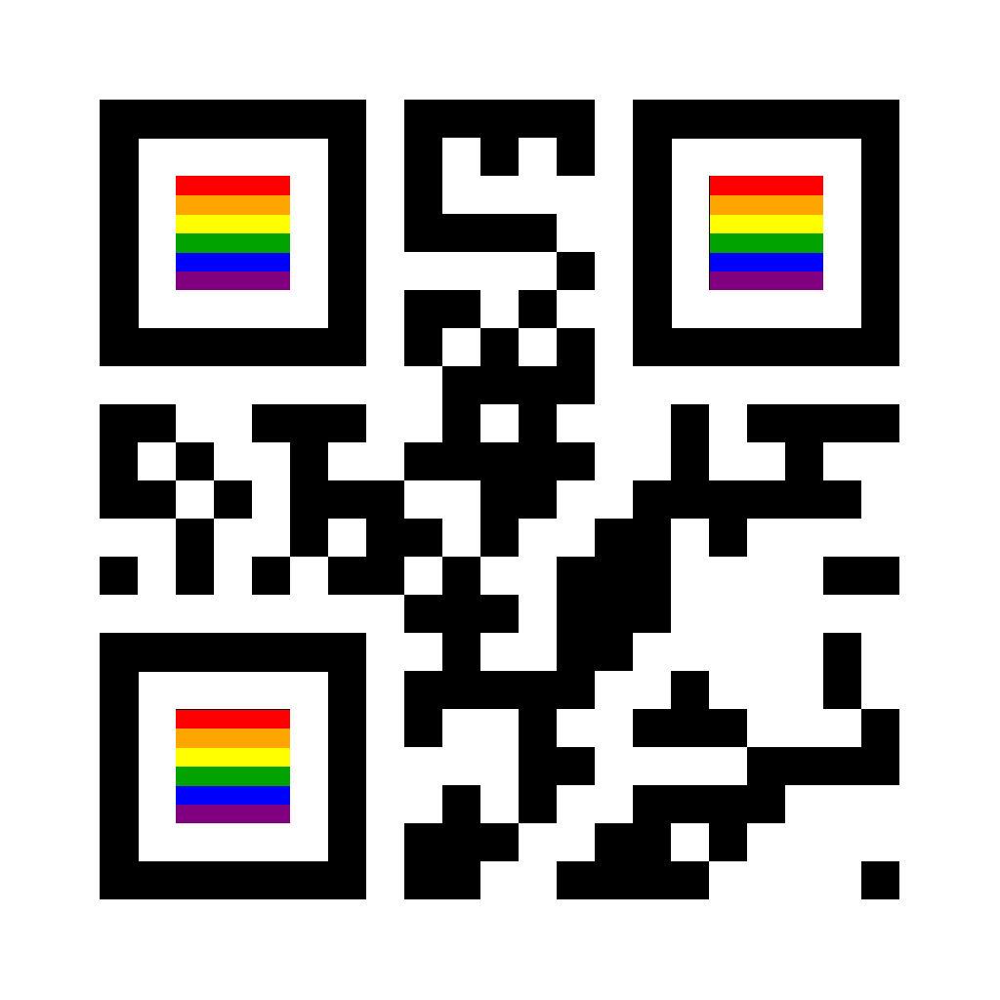
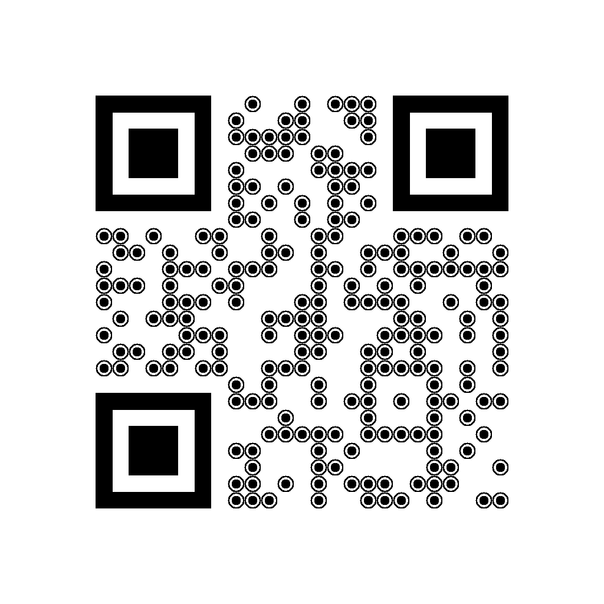
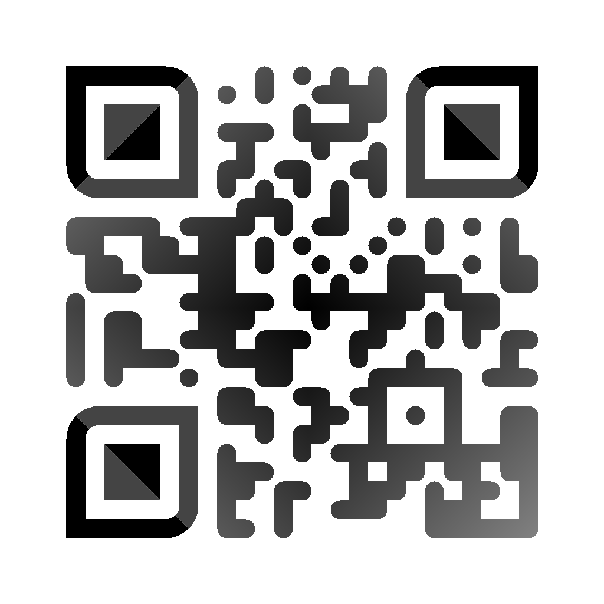

# Сustom QR generator for Android
Android library for creating QR-codes with logo, custom pixel/eyes shapes, background image. Powered by <a href="https://github.com/zxing/zxing">ZXing</a>.

<table>
  <tr>
    <td></td>
    <td></td>
    <td></td>
  </tr>
</table>

Some useful links:
- [Examples](/examples) with source code
- [Wiki](https://github.com/alexzhirkevich/custom-qr-generator/wiki)
- [Version for Flutter](https://github.com/alexzhirkevich/custom-qr-generator-flutter) with some limitations

## Table of contents
- [Installation](#installation)
- [Usage](#usage)
- [Customization](#customization)
- [Serialization](#serialization)
- [FAQ](#faq)


## Installation
[](https://jitpack.io/#alexzhirkevich/custom-qr-generator)
[](https://jitpack.io/#alexzhirkevich/custom-qr-generator)
[](https://jitpack.io/#alexzhirkevich/custom-qr-generator)
<br>To get a Git project into your build:

<b>Step 1.</b> Add the JitPack repository to your build file
```gradle
allprojects {
    repositories {
      ...
        maven { url 'https://jitpack.io' }
    }
}
```
Or for gradle 7+ to settings.gradle file:
```gradle
dependencyResolutionManagement {
    repositories {
        ...
        maven { url 'https://jitpack.io' }
    }
}
```

<b>Step 2.</b> Add the dependency.
```gradle
dependencies {
    implementation 'com.github.alexzhirkevich:custom-qr-generator:1.5.6'
}
```
<b>Step 3.</b> Press ⭐ if you liked this lib


## Usage

There are 2 types of QR code image - raster (deprecated) image and vector image. 

|  | Raster (deprecated)| Vector |
| --- | --- | --- |
| Output image type | `android.graphics.Bitmap` | `android.graphics.drawable.Drawable` |
| Size | ❌ Fixed | ✅ Dynamic. Based on `View` size |
| Speed | ❌ Slow (> 500 ms in average), so must be created in advance and only in background thread. Coroutines support included | ✅ Instant. All calculations performed during `Drawable.setBounds`, almost instantly |

You should use deprecated Raster QR codes only if you need extra customizability or special features like in [this example](/examples/tiktok).

### Jetpack Compose

#### Before 1.5.5 

`Drawable` QR codes <ins>should not</ins> be converted to `Bitmap`. Use [this Accompanist library](https://google.github.io/accompanist/drawablepainter/) or `AndroidView` for Jetpack Compose interop.

#### After 1.5.5 

`Drawable` QR codes can be safely coverted to `Bitmap` and used as Compose `ImageBitmap`. Previous solutions work too.

---

### Vector code (Drawable)

<b>Step 1.</b> Create QR code data. There are multiple QR types: Plain Text, Url, Wi-Fi,
Email, GeoPos, Profile Cards, Phone, etc.

```kotlin
val data = QrData.Url("https://example.com")
```

<b>Step 2.</b> Define styling options.

#### 1. Using DSL:

```kotlin
val options = createQrVectorOptions {
    
    padding = .125f

    background {
        drawable = DrawableSource
            .Resource(R.drawable.frame)
    }
    
    logo {
        drawable = DrawableSource
            .Resource(R.drawable.tg)
        size = .25f
        padding = QrVectorLogoPadding.Natural(.2f)
        shape = QrVectorLogoShape
            .Circle
    }
    colors {
        dark = QrVectorColor
            .Solid(Color(0xff345288))
        ball = QrVectorColor.Solid(
            ContextCompat.getColor(context, R.color.your_color)
        )
    }
    shapes {
        darkPixel = QrVectorPixelShape
            .RoundCorners(.5f)
        ball = QrVectorBallShape
            .RoundCorners(.25f)
        frame = QrVectorFrameShape
            .RoundCorners(.25f)
    }
}
```

#### 2. Using builder:

```kotlin
val options = QrVectorOptions.Builder()
    .padding(.3f)
    .logo(
        QrVectorLogo(
            drawable = DrawableSource
                .Resource(R.drawable.tg),
            size = .25f,
            padding = QrVectorLogoPadding.Natural(.2f),
            shape = QrVectorLogoShape
                .Circle
        )
    )
    .background(
        QrVectorBackground(
            drawable = DrawableSource
                .Resource(R.drawable.frame),
        )
    )
    .colors(
        QrVectorColors(
            dark = QrVectorColor
                .Solid(Color(0xff345288)),
            ball = QrVectorColor.Solid(
                ContextCompat.getColor(context, R.color.your_color)
            )
        )
    )
    .shapes(
        QrVectorShapes(
            darkPixel = QrVectorPixelShape
                .RoundCorners(.5f),
            ball = QrVectorBallShape
                .RoundCorners(.25f),
            frame = QrVectorFrameShape
                .RoundCorners(.25f),
        )
    )
    .build()
```

<b>Step 3.</b> Create QR code drawable:

```kotlin
val drawable = QrCodeDrawable(context, data, options)
```

---

### Raster code (Bitmap)


<details>
<summary>Deprecated (click to show)</summary>

<b>Step 1.</b> Create QR code data. There are multiple QR types: Plain Text, Url, Wi-Fi,
Email, GeoPos, Profile Cards, Phone, etc.

```kotlin
val data = QrData.Url("https://example.com")
```

<b>Step 2.</b> Define styling options using builder:

```kotlin
// Color(v : Long) and Long.toColor() functions take 
// 0xAARRGGBB long and convert it to color int.
// Colors from android resources also can be used.
val options = QrOptions.Builder(1024)
    .padding(.3f)
    .background(
        QrBackground(
            drawable = DrawableSource
                  .Resource(R.drawable.frame),
        )
    )
    .logo(
        QrLogo(
            drawable = DrawableSource
                  .Resource(R.drawable.tg),
            size = .25f,
            padding = QrLogoPadding.Accurate(.2f),
            shape = QrLogoShape
                .Circle
        )
    )
    .colors(
        QrColors(
            dark = QrColor
                .Solid(Color(0xff345288)),
            highlighting = QrColor
                .Solid(0xddffffff.toColor()),
        )
    )
    .shapes(
        QrElementsShapes(
            darkPixel = QrPixelShape
                .RoundCorners(),
            ball = QrBallShape
                .RoundCorners(.25f),
            frame = QrFrameShape
                .RoundCorners(.25f),
            highlighting = QrBackgroundShape
                .RoundCorners(.05f)
        )
    )
    .build()
```

Or using DSL:

```kotlin
val options = createQrOptions(1024, 1024, .3f) {
    background {
        drawable = DrawableSource
            .Resource(R.drawable.frame)
    }
    logo {
        drawable = DrawableSource
            .Resource(R.drawable.tg)
        size = .25f
        padding = QrLogoPadding.Accurate(.2f)
        shape = QrLogoShape
            .Circle
    }
    colors {
        dark = QrColor
            .Solid(0xff345288.toColor())
        highlighting = QrColor
            .Solid(Color(0xddffffff))
    }
    shapes {
        darkPixel = QrPixelShape
            .RoundCorners()
        ball = QrBallShape
            .RoundCorners(.25f)
        frame = QrFrameShape
            .RoundCorners(.25f)
        highlighting = QrBackgroundShape
            .RoundCorners(.05f)
    }
}
```

<b>Step 3.</b> Create a QR code generator and pass your data and options into it:

```kotlin  
val generator = QrCodeGenerator(context)
  
val bitmap = generator.generateQrCode(data, options)
```
`QrCodeGenerator` is an interface, but also is a function, that returns generator instance. 

‼️ Raster QR codes must be generated in BACKGROUND THREAD. Generator supports cancellation with coroutines.
`generateQrCodeSuspend` is always performed with `Dispatchers.Default`

```kotlin  
//todo: don't use GlobalScope
GlobalScope.launch {
    val bitmap = generator.generateQrCodeSuspend(data, options)
}
```

Generator can work in parallel threads (different Default coroutine dispatchers).
By default generator works in SingleThread. To change it pass another ```ThreadPolicy``` to
```QrCodeGenerator``` function.

For example:

```kotlin
val threadPolicy = when(Runtime.getRuntime().availableProcessors()){
    in 1..3 -> ThreadPolicy.SingleThread
    in 4..6 -> ThreadPolicy.DoubleThread
    else -> ThreadPolicy.QuadThread
}

val generator = QrCodeGenerator(context, threadPolicy)

```

‼️ <b>NOTE: Use wisely! More threads doesn't mean more performance!</b> It depends on device
and size of the QR code.

</details>

## Customization

### Vector code (Drawable)

Shapes of QR code elements can be customized using `android.graphics.Path`.

For example, this is an implementation of circle pixels:



```kotlin
object Circle : QrVectorPixelShape {

    override fun createPath(size: Float, neighbors: Neighbors): Path = Path().apply {
        addCircle(size/2f, size/2f, size/2, Path.Direction.CW)
    }
}
```

Colors of QR code elements can be customized using `android.graphics.Paint`.

For example, this is an implementation of sweep gradient:

```kotlin
 class SweepGradient(
        val colors: List<Pair<Float, Int>>
    ) : QrVectorColor {

        override fun createPaint(width: Float, height: Float): Paint =
            Paint().apply {
              shader = android.graphics.SweepGradient(
                  width / 2, height / 2,
                  colors.map { it.second }.toIntArray(),
                  colors.map { it.first }.toFloatArray()
              )
        }
    }
    
```


### Raster code (Bitmap) 

<details>
<summary>Deprecated (click to show)</summary>

You can easily implement your own shapes and coloring for QR Code in 2 ways:
using math formulas or by drawing on canvas. Second way is usually slower
and uses a lot of memory but provides more freedom.

For example:

1. Using math formulas:
<table>
<tr>
<td>

</td>
<td>

```kotlin
object Circle : QrPixelShape {
    override fun invoke(
        i: Int, j: Int, elementSize: Int, neighbors: Neighbors
    ): Boolean {
        val center = elementSize/2.0
        return sqrt((center-i).pow(2) + (center-j).pow(2)) < center
    }
}

val options = createQrOptions(1024, .3f) {
    shapes {
        darkPixel = Circle
    }
}
```

</td>
</tr>
<tr>
<td>


</td>
<td>

```kotlin

//It is not scannable. Don't create such colorful QR codes
object Pride : QrColor {
    override fun invoke(
        i: Int, j: Int, width : Int, height : Int
    ): Int {
        return when(6f * j/height){
            in 0f..1f -> Color.RED
            in 1f..2f-> Color(0xffffa500)
            in 2f..3f-> Color.YELLOW
            in 3f..4f-> Color(0xff00A300)
            in 4f..5f-> Color.BLUE
            else -> Color(0xff800080)
        }
    }
}

val options = createQrOptions(1024) {
    colors {
        ball = Pride
    }
}
```

</td>
</tr>
</table>

2. By drawing on canvas:

<table>
<td>

</td>
<td>

```kotlin  
val options : QrOptions = createQrOptions(1024) {
    shapes {
        darkPixel = drawShape { canvas, drawPaint, erasePaint ->
          val cx = canvas.width/2f
          val cy = canvas.height/2f
          val radius = minOf(cx,cy)
          canvas.drawCircle(cx, cy, radius, drawPaint)
          canvas.drawCircle(cx, cy, radius*2/2.5f, erasePaint)
          canvas.drawCircle(cx, cy, radius/1.75f, drawPaint)
        }
    }
}
```
</td>
</table>

```drawShape``` is a generic function that can be used only inside a `shapes` or `logo` scope
and only to create properties of `QrElementsShapes` or `QrLogoShape`.
Usage with other type-parameters will cause an exception.

‼️ <b>NOTE: Created shape should not be used with other ```QrOptions``` with larger size!</b>
This can cause shape quality issues.

You can also implement ```QrCanvasShape``` and cast it so necessary shape:

```kotlin  
object Ring : QrCanvasShape {
   override fun draw(
       canvas: Canvas, drawPaint: Paint, erasePaint: Paint
   ) {
       // ...
   }
}

val ring : QrPixelShape = Ring
    .toShapeModifier(elementSize = 48)
    .asPixelShape()
// or automatically determine size with DSL
val ringPixelOptions : QrOptions = createQrOptions(1024){
    shapes {
        darkPixel = drawShape(Ring::draw)
    }
}
```

<table>
<td>

</td>
<td>

```kotlin  
object CanvasColor : QrCanvasColor {
    override fun draw(canvas: Canvas) = with(canvas) {
        withRotation(135f, width/2f, height/2f) {
            drawRect(-width / 2f, -height / 2f,
                1.5f * width, height / 2f,
                Paint().apply { color = Color.BLACK }
            )
            drawRect(-width / 2f, height / 2f, 
                1.5f * width.toFloat(), 1.5f * height.toFloat(),
                Paint().apply { color = Color.DKGRAY }
            )
        }
    }
}
   
```
</td>
</table>

Using ```draw``` function inside `colors` scope you can colorize your code elements as you want.
It will be converted to a ```QrColor```.

This is ```QrOptions``` of the code above:

```kotlin
val options =  createQrOptions(1024, .2f) {
    colors {
        dark = QrColor.RadialGradient(
            startColor = Color.GRAY,
            endColor = Color.BLACK
        )
        ball = draw(CanvasColor::draw)
        frame = draw {
            withRotation(
                180f, width / 2f,
                height / 2f, CanvasColor::draw
            )
        }
        symmetry = true
    }
    shapes {
        darkPixel = QrPixelShape.RoundCorners()
        frame = QrFrameShape.RoundCorners(
            .25f, outer = false, inner = false
        )
    }
}
```

‼️ NOTE: Created color should not be used with other QrOptions with larger size!

</details>

## Serialization

`QrOptions`, `QrVectorOptions` and `QrData` can be serialized using kotlinx-serialization (actually any class
from style package can be serialized). All options and QrData classes have `@Serializable` annotation.
Every class with interface preperties (or property interfaces themselve) have companion object with
`defaultSerializersModule` property. It provides kotlinx-serialization `SerializersModule` that
can be used to serialize it default instances.

There is global value `QrSerializersModule`, that can be used to serialize any serializable class instance.

‼️ If you implemented custom shape, color or other option, it must be added to module.

Example (requires `org.jetbrains.kotlinx:kotlinx-serialization-json` dependency and `kotlinx-serialization` plugin):

```kotlin

val options = createQrOptions(1024){
    //...
}

val json = Json {
    serializersModule = QrSerializersModule
}

val string = json.encodeToString(options)
val decoded = json.decodeFromString<QrOptions>(string)

assert(options == decoded) // true for default options only
```

If you want to serialize custom options, `QrSerializersModule` must be extended:

```kotlin
@Serializable
class Custom : QrPixelShape {
    override fun invoke(
        i: Int, j: Int, elementSize: Int, neighbors: Neighbors
    ): Boolean {
        //...
    }
}

val options = createQrOptions(1024){
    shapes {
        darkPixel = Custom()
    }
}

val json = Json {
    serializersModule = SerializersModule {
        include(QrSerializersModule)
        polymorphic(QrPixelShape::class){
            subclass(Custom::class)
        }
    }
}

val string = json.encodeToString(options)
val decoded = json.decodeFromString<QrOptions>(string)

assert(options == decoded) //true
```

Serialization can be useful for remote config QR code style changing or to store
generated codes with their options for later modification (for ex, in QR code generator apps)

## FAQ

### I can't scan my code

- Some combinations of shapes are not compatible.
- If you create custom shapes, always test if they corrupt your qr code. 
- Choose contrast colors for your code and dont't use too many of them at once. 
- If you are using logo, make it smaller or apply next advice.
- Set `errorCorrectionLevel` explicitly to `QrErrorCorrectionLevel.High`

---

### I'm trying to encode non-latin symbols and getting a corrupted QR code

See [Issue #6](https://github.com/alexzhirkevich/custom-qr-generator/issues/6)

---

### I want to create shapes for frame or ball with central symmetry

See [Issue #13](https://github.com/alexzhirkevich/custom-qr-generator/issues/13)

--- 

