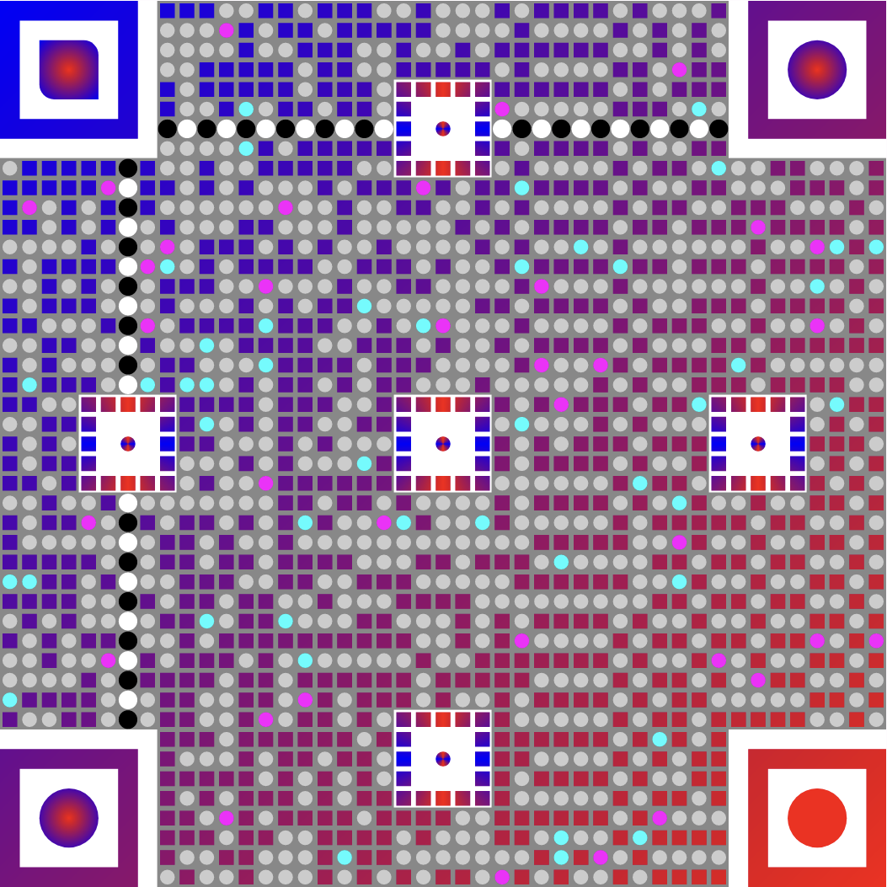

# Сustom QR generator for Android
Android library for creating QR-codes with logo, custom pixel/eyes shapes, background image. Powered by <a href="https://github.com/zxing/zxing">ZXing</a>.

<table>
  <tr>
    <td></td>
    <td></td>
    <td></td>
  </tr>
</table>

## Playground

Try library features on live app example

<a href="https://play.google.com/store/apps/details?id=com.github.alexzhirkevich.qrdesigner"></a>

I'll be glad, if you leave a positive review for it in Google Play 😊

Some useful links:
- [Version for Flutter](https://github.com/alexzhirkevich/custom-qr-generator-flutter) with limited functionality

## Table of contents
- [Installation](#installation)
- [Usage](#usage)
- [Customization](#customization)
- [FAQ](#faq)


## Installation
[](https://github.com/alexzhirkevich/custom-qr-generator/actions/workflows/android.yml)
[](https://jitpack.io/#alexzhirkevich/custom-qr-generator)
[](https://jitpack.io/#alexzhirkevich/custom-qr-generator)
[](https://jitpack.io/#alexzhirkevich/custom-qr-generator)
<br>To get a Git project into your build:

<b>Step 1.</b> Add the JitPack repository to your build file
```gradle
allprojects {
    repositories {
      ...
        maven { url 'https://jitpack.io' }
    }
}
```
Or for gradle 7+ to settings.gradle file:
```gradle
dependencyResolutionManagement {
    repositories {
        ...
        maven { url 'https://jitpack.io' }
    }
}
```

<b>Step 2.</b> Add the dependency.
```gradle
dependencies {
    implementation 'com.github.alexzhirkevich:custom-qr-generator:1.6.2'
}

```

## Usage

<b>Step 1.</b> Create QR code data. There are multiple QR types: Plain Text, Url, Wi-Fi,
Email, GeoPos, Profile Cards, Phone, etc.

```kotlin
val data = QrData.Url("https://example.com")
```

<b>Step 2.</b> Define styling options.

#### 1. Using DSL:

```kotlin
val options = createQrVectorOptions {
    
    padding = .125f

    background {
        drawable = ContextCompat
            .getDrawable(context, R.drawable.frame)
    }
    
    logo {
        drawable = ContextCompat
            .getDrawable(context, R.drawable.logo)
        size = .25f
        padding = QrVectorLogoPadding.Natural(.2f)
        shape = QrVectorLogoShape
            .Circle
    }
    colors {
        dark = QrVectorColor
            .Solid(Color(0xff345288))
        ball = QrVectorColor.Solid(
            ContextCompat.getColor(context, R.color.your_color)
        )
    }
    shapes {
        darkPixel = QrVectorPixelShape
            .RoundCorners(.5f)
        ball = QrVectorBallShape
            .RoundCorners(.25f)
        frame = QrVectorFrameShape
            .RoundCorners(.25f)
    }
}
```

#### 2. Using builder:

```kotlin
val options = QrVectorOptions.Builder()
    .setPadding(.3f)
    .setLogo(
        QrVectorLogo(
            drawable = ContextCompat
                .getDrawable(context, R.drawable.logo),
            size = .25f,
            padding = QrVectorLogoPadding.Natural(.2f),
            shape = QrVectorLogoShape
                .Circle
        )
    )
    .setBackground(
        QrVectorBackground(
            drawable = ContextCompat
                .getDrawable(context, R.drawable.frame),
        )
    )
    .setColors(
        QrVectorColors(
            dark = QrVectorColor
                .Solid(Color(0xff345288)),
            ball = QrVectorColor.Solid(
                ContextCompat.getColor(context, R.color.your_color)
            )
        )
    )
    .setShapes(
        QrVectorShapes(
            darkPixel = QrVectorPixelShape
                .RoundCorners(.5f),
            ball = QrVectorBallShape
                .RoundCorners(.25f),
            frame = QrVectorFrameShape
                .RoundCorners(.25f),
        )
    )
    .build()
```

<b>Step 3.</b> Create QR code drawable:

```kotlin
val drawable : Drawable = QrCodeDrawable(data, options)
```

To interop with <b><i>Jetpack Compose</i></b>, you can use [this](https://google.github.io/accompanist/drawablepainter/) library (recommended) or convert `Drawable` to `Bitmap` (not recommended).

<b>Step 4.</b> Press ⭐ if you liked this lib

---

## Customization

Shapes of QR code elements can be customized using `android.graphics.Path`.

For example, this is an implementation of circle pixels:


```kotlin
object Circle : QrVectorPixelShape {

    override fun Path.path(size: Float, neighbors: Neighbors) {
        addCircle(size/2f, size/2f, size/2, Path.Direction.CW)
    }
}
```

Colors of QR code elements can be customized using `android.graphics.Paint`.

For example, this is an implementation of sweep gradient:

```kotlin
 class SweepGradient(
        val colors: List<Pair<Float, Int>>
    ) : QrVectorColor {

        // change to Separate to enable pixel-by-pixel painting
        override val mode: QrPaintMode
            get() = QrPaintMode.Combine

        override fun Paint.paint(width: Float, height: Float, neighbors : Neighbors) {
            shader = android.graphics.SweepGradient(
                width / 2, height / 2,
                colors.map { it.second }.toIntArray(),
                colors.map { it.first }.toFloatArray()
            )
        }
    }
    
```

## FAQ

### I can't scan my code

- Some combinations of shapes are not compatible.
- If you create custom shapes, always test if they corrupt your qr code. 
- Choose contrast colors for your code and dont't use too many of them at once. 
- If you are using logo, make it smaller or apply next advice.
- Set `errorCorrectionLevel` explicitly to `QrErrorCorrectionLevel.High`

---

### I'm trying to encode non-latin symbols and getting a corrupted QR code

See [Issue #6](https://github.com/alexzhirkevich/custom-qr-generator/issues/6)

---

### I want to create shapes for frame or ball with central symmetry

See [Issue #13](https://github.com/alexzhirkevich/custom-qr-generator/issues/13)

---

### I want a QR code with 4 eyes

See [Issue #19](https://github.com/alexzhirkevich/custom-qr-generator/issues/19)


--- 

