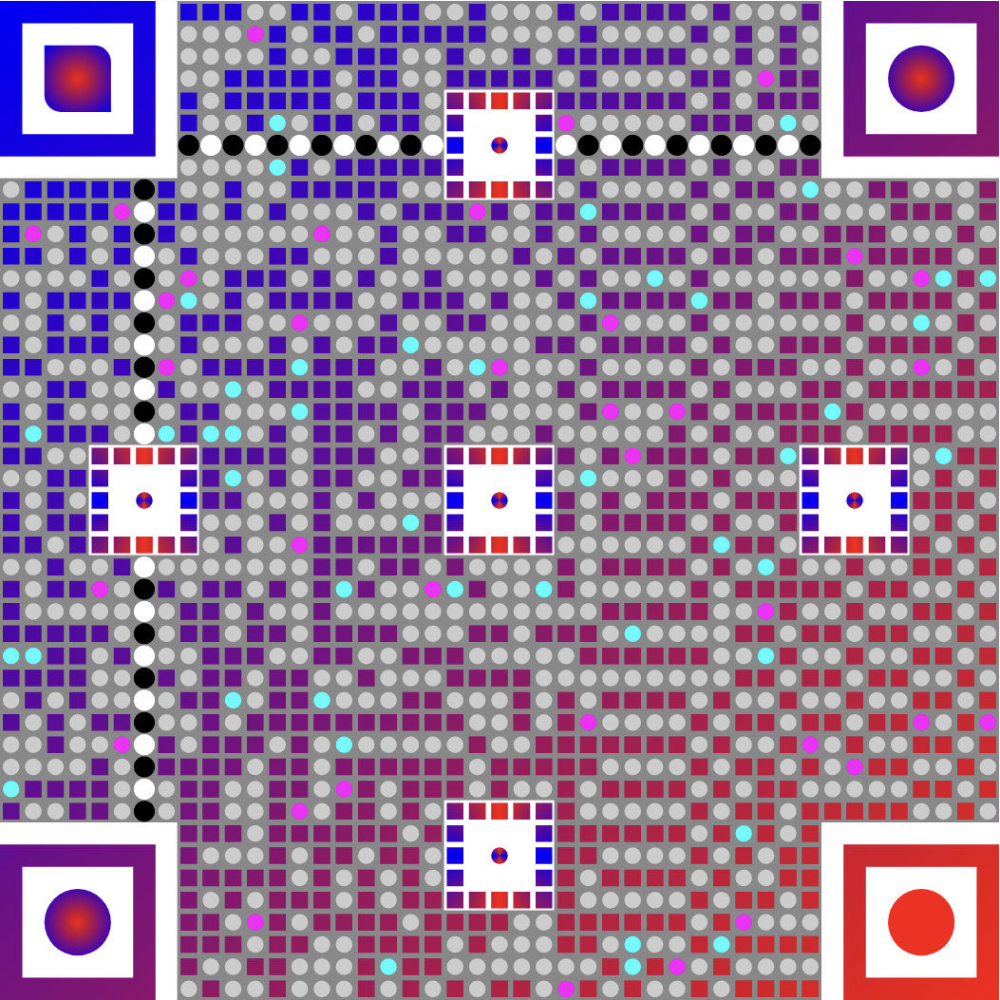

```kotlin
val options = createQrVectorOptions {

    fourthEyeEnabled = true

    highlighting {
        cornerEyes = HighlightingType.Default
        timingLines = HighlightingType.Styled(
            shape = QrVectorPixelShape.Circle(.95f),
            elementShape = QrVectorBallShape.Circle(.95f),
        )
        versionEyes = HighlightingType.Styled(
            elementShape = QrVersionEyeShape(
                frame = QrVectorFrameShape.AsPixelShape(
                    pixelShape = QrVectorPixelShape.Rect(.75f),
                    size = 5
                ),
                ball = QrVectorBallShape.Circle(.75f)
            ),

            elementColor = QrVectorColor.SweepGradient(
                listOf(
                    0f to android.graphics.Color.BLUE,
                    1 / 4f to android.graphics.Color.RED,
                    2 / 4f to android.graphics.Color.BLUE,
                    3 / 4f to android.graphics.Color.RED,
                    4 / 4f to android.graphics.Color.BLUE,
                )
            )
        )
    }

    background {
        color = QrVectorColor.Solid(android.graphics.Color.GRAY)
    }


    colors {
        light = QrVectorColor.SolidRandom(
            listOf(
                1f to android.graphics.Color.LTGRAY,
                .05f to android.graphics.Color.MAGENTA,
                .05f to android.graphics.Color.CYAN,
            )
        )

        ball = SeparateColorForBottomRightBall(
            bottomRight = QrVectorColor.Solid(android.graphics.Color.RED),
            other = QrVectorColor.RadialGradient(
                listOf(
                    0f to android.graphics.Color.RED,
                    1f to android.graphics.Color.BLUE,
                )
            )
        )

        dark = QrVectorColor.LinearGradient(
            listOf(
                0f to android.graphics.Color.BLUE,
                1f to android.graphics.Color.RED,
            ), QrVectorColor.LinearGradient.Orientation.LeftDiagonal
        )
    }
    shapes {
        darkPixel = QrVectorPixelShape
            .Rect(.75f)
        lightPixel = QrVectorPixelShape
            .Circle(.75f)
        // you also can create custom shapes and colors inline.
        // for pixels it's better to create classes to increase performance
        ball = QrVectorBallShape { size, neighbors ->
            val path = if (neighbors.bottom & neighbors.right)
                QrVectorBallShape.RoundCorners(
                    radius = .25f,
                    topLeft = false,
                    bottomRight = false
                )
            else QrVectorBallShape.Circle()

            path.run {
                shape(size, neighbors)
            }
        }
    }
}
```
```kotlin
class SeparateColorForBottomRightBall(
    private val bottomRight : QrVectorColor,
    private val other : QrVectorColor
) : QrVectorColor {

    override fun Paint.paint(width: Float, height: Float, neighbors : Neighbors) {
        val color = if (neighbors.topLeft)
            bottomRight
        else other

        color.run {
            paint(width, height, neighbors)
        }
    }
}
```
